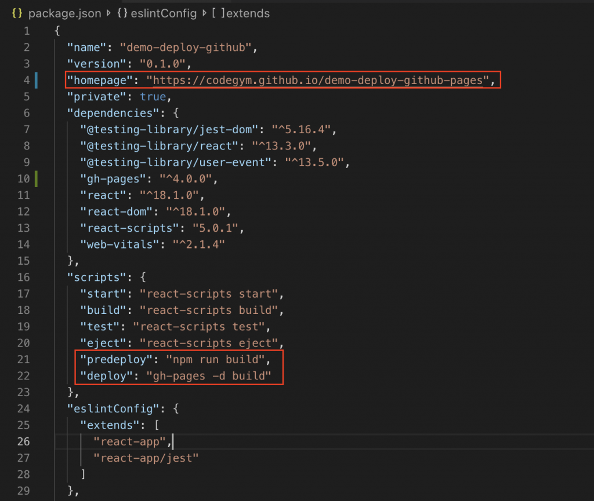

1. Cài đặt “gh-pages” package vào project

npm i gh-pages 2. Chỉnh sửa file package.json

Mở file package.json của project lên và thêm các thiết lập:

Chỉ định đường dẫn “homepage” tới trang web của bạn
"homepage": "https://<username>.github.io/<repository>"
Lệnh để deploy, redeploy ứng dụng
"predeploy": "npm run build",
"deploy": "gh-pages -d build",

3. Deploy ứng dụng bằng câu lệnh

npm run deploy
Truy cập trang web của bạn (https://<username>.github.io/<repository>) và xem kết quả

